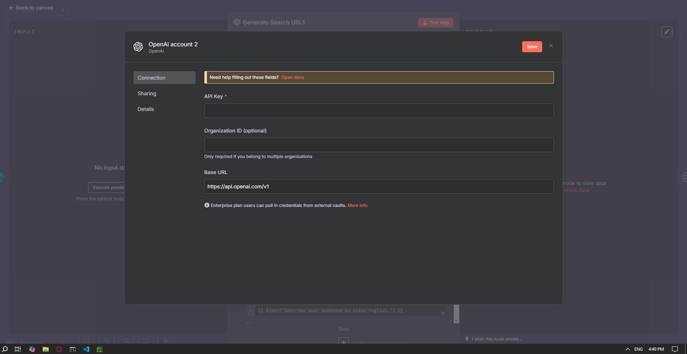

# My Cold Outerach n8n Template

```
This is a guide to self host the tool, all on your computer

```
##  Project Components

- **Front End App**: https://github.com/JKHellNo/audience-alchemy-connect
- **Scrapper (Apollo Contacts, 25 contacts max as pagination feature not included)**: https://github.com/JKHellNo/browser-apollo-scrapper

---


# Step 1: Self-Host n8n and Create a Workflow

To get started quickly, run n8n locally using `npx`:

```bash
npx n8n

Create your account

Log in with your account

Create a workflow

Import the json file from this repo

It should end up looking like the bottom screenshot below
```


# Step 2: Setting up OpenAI API


```
Go to OpenAI API https://platform.openai.com/docs/overview 
After logging in, go and generate your API key for n8n https://platform.openai.com/settings/organization/api-keys
You will have to add $5 dollars to your billing account to use the API if you haven't done so before

After getting your API key, you want to go back to n8n and connect it to any OpenAI node by clicking on any OpenAI node
Follow the images below and paste in your API key

```





# Step 3: Setting up the Scrapper
```
There are instructions on how to deploy the scrapper on the repo itself (git clone, npm install, npm start) 
sidenote:if you manage to web host/deploy the scrapper, teach me if possible(whether it's the docker container or env variable setting for chromium)

Sign in to https://www.apollo.io with Google Oauth method and skim through the onboarding process(not important, just tedious)
After that you can close Apollo, and follow the screenshots below
Open the scrapper node, use the same email and password that you used to log in to Apollo and fill it into the n8n scrapper node (make sure the you 'npm start' the server)
Optionally, to visually experience what the scrapper does, follow the last screenshot, and change 'Headless:' to false,

```


# Step 4: Setting up Google Sheets API
```
Follow this video https://www.youtube.com/watch?v=pWGXlZBGu4k 
After the video, you'll have an API key and have successfully connected to n8n
Go to Google Drive and create a Google Sheets that serves as the database for this outreach tool
...

```


# Step 5: Setting up Phantombustor API
```
container id is in the url
...
```

