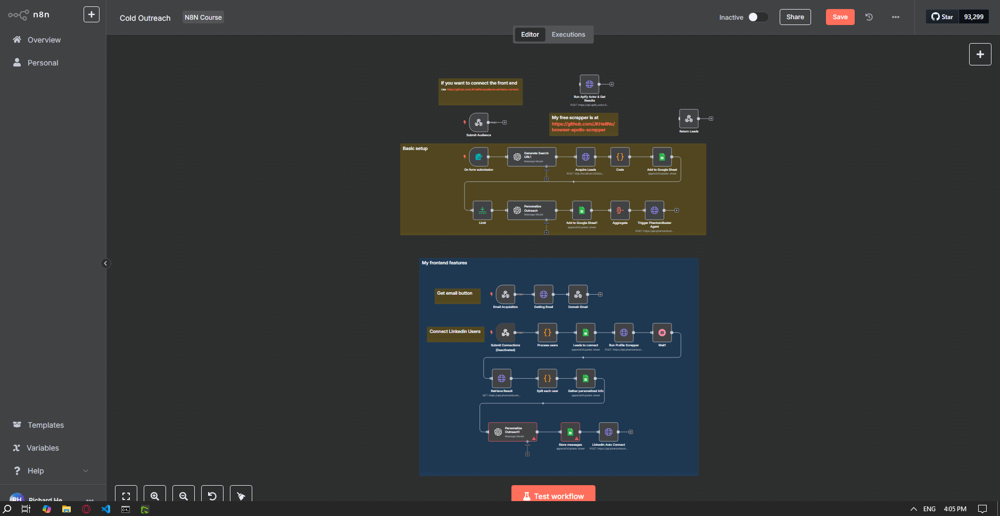

# My Cold Outerach n8n Template

# Step 1: Self-Host n8n and Create a Workflow

To get started quickly, run n8n locally using `npx`:

```bash
npx n8n

Create your account

Log in with your account

Create a workflow

Import the json file from this repo

It should end up looking like the bottom screenshot below
```




# Step 2: Set up API


```
Go to OpenAI API https://platform.openai.com/docs/overview 
After logging in, go and generate your API key for n8n https://platform.openai.com/settings/organization/api-keys
You will have to add $5 dollars to your billing account to use the API if you haven't done so before

After getting your API key, you want to go back to n8n and connect it to any OpenAI node like the first screenshot below

```


